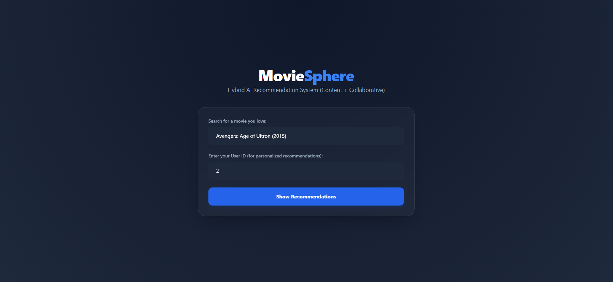
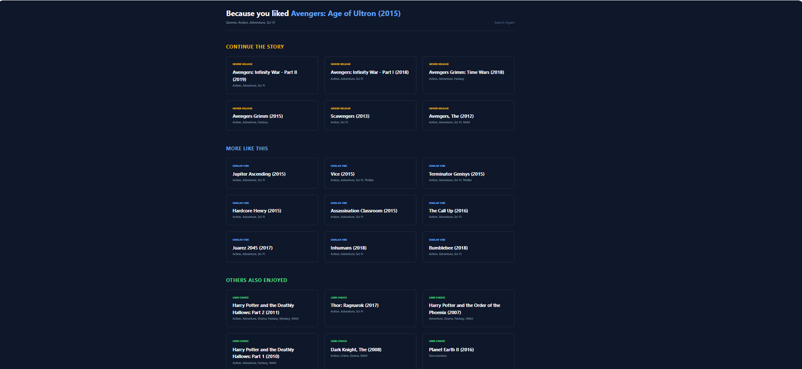

  <h1>🎬 Movie Recommendation System – Hybrid AI Recommender</h1>
  
<strong>A smart movie recommendation web application using Hybrid Filtering.</strong>

<h2>📌 Project Overview</h2>

This project is a <strong>Hybrid Recommendation System</strong> that combines:

<ul>
  <li><strong>Content-Based Filtering (CBF)</strong></li>
  <li><strong>Collaborative Filtering (SVD - Matrix Factorization)</strong></li>
</ul>

It first selects similar movies using content similarity, then ranks them using collaborative filtering for personalized recommendations.

<h2>🎯 Recommendation Strategy</h2>

<ul>
  <li><strong>Step 1:</strong> Select Top 30 similar movies using TF-IDF + Cosine Similarity</li>
  <li><strong>Step 2:</strong> Rank candidates using SVD collaborative filtering</li>
  <li><strong>Final Output:</strong> Personalized Top Recommendations</li>
</ul>

<h2>🔎 Content-Based Filtering</h2>

<ul>
  <li><strong>Technique:</strong> TF-IDF Vectorization</li>
  <li><strong>Similarity Metric:</strong> Cosine Similarity</li>
  <li><strong>Features Used:</strong> Movie Title + Genres</li>
  <li><strong>Model Saved As:</strong> content_similarity.pkl</li>
</ul>

<h2>🤝 Collaborative Filtering</h2>

<ul>
  <li><strong>Type:</strong> Model-Based Collaborative Filtering</li>
  <li><strong>Algorithm Used:</strong> SVD (Matrix Factorization)</li>
  <li><strong>Library:</strong> Surprise</li>
  <li><strong>Model Saved As:</strong> svd_model.pkl</li>
</ul>

<h2>🚀 Main Features</h2>

<ul>
  <li>Personalized recommendations for each user</li>
  <li>"Continue the Story" section (detects movie series)</li>
  <li>"More Like This" (Content-Based)</li>
  <li>"Others Also Enjoyed" (Collaborative Filtering)</li>
  <li>Fast prediction using pre-saved artifacts</li>
  <li>Clean Flask-based Web Interface</li>
</ul>

<h2>🖼️ Application Preview</h2>

<h3>🏠 Home Page</h3>

  

<h3>🎯 Recommendation Page</h3>

<h2>🛠️ Technologies Used</h2>

<ul>
  <li><strong>Python</strong></li>
  <li><strong>Flask</strong></li>
  <li><strong>Scikit-learn</strong></li>
  <li><strong>Surprise (SVD)</strong></li>
  <li><strong>Pandas & NumPy</strong></li>
</ul>

<h2>📖 How to Run</h2>

<ol>
  <li>Clone Repository:
    <pre>git clone https://github.com/your-username/your-repo-name.git</pre>
  </li>
  <li>Install Requirements:
    <pre>pip install -r requirements.txt</pre>
  </li>
  <li>Check Artifacts Folder:
    <pre>
/artifacts
 ├── content_similarity.pkl
 └── svd_model.pkl
    </pre>
  </li>
  <li>Run App:
    <pre>python app.py</pre>
  </li>
</ol>

<h2>⚠️ Note</h2>

This project demonstrates how hybrid recommendation systems combine 
content similarity and collaborative filtering to improve personalization and ranking.

  
<i>Developed by <b>Vidhi</b> 🎬</i>

